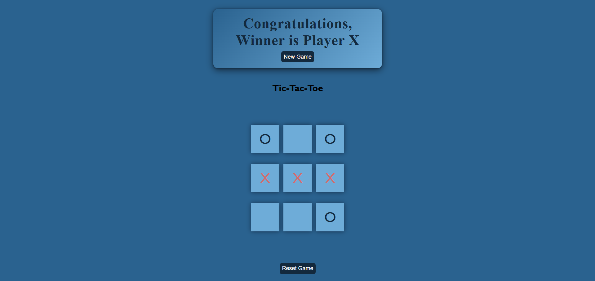

🎮 Tic-Tac-Toe Game

A simple and responsive Tic-Tac-Toe game built with HTML, CSS, and JavaScript. This game allows two players to play in turns with a clean and interactive UI, and it detects wins, draws, and offers reset/new game options.

📸 Preview

🚀 Features

- 2-player turn-based gameplay (O & X)
- Win detection for all possible combinations
- Draw detection if no moves remain
- Reset game and new game functionality
- Responsive UI with clean design
- Hover effect and color feedback

🛠️ Tech Stack

- HTML5 – Page structure
- CSS3 – Styling and layout
- JavaScript (Vanilla) – Game logic and interactivity

📁 Project Structure

TicTacToe/
│
├── index.html # Main HTML file
├── style.css # Stylesheet
├── App.js # Game logic in JavaScript
├── README.md # Project documentation
└── screenshot.png # Game preview image

▶️ How to Run Locally

1. Clone or Download the repository:
  - git clone https://github.com/san-soni30/TicTacToe.git
2. Open index.html in your browser:
  - You can simply double-click it.
  - Or use a local server (like Live Server in VSCode).

🧠 Game Rules
   - Player O always starts the game.
   - Players take turns placing their mark in an empty cell.
   - The first player to align 3 marks in a row, column, or diagonal wins.
   - If all 9 cells are filled with no winner, the game is a draw.

📦 To Do (Optional Improvements)
   - Add single-player mode vs. computer
   - Add player score tracking
   - Add sound effects and animations
   - Deploy online via GitHub Pages or Netlify

📄 License
   - This project is open-source and available under the MIT License.

🙌 Acknowledgements
   - Created as a fun project to practice JavaScript DOM manipulation and game logic.
     Design inspired by minimal, interactive UIs.

